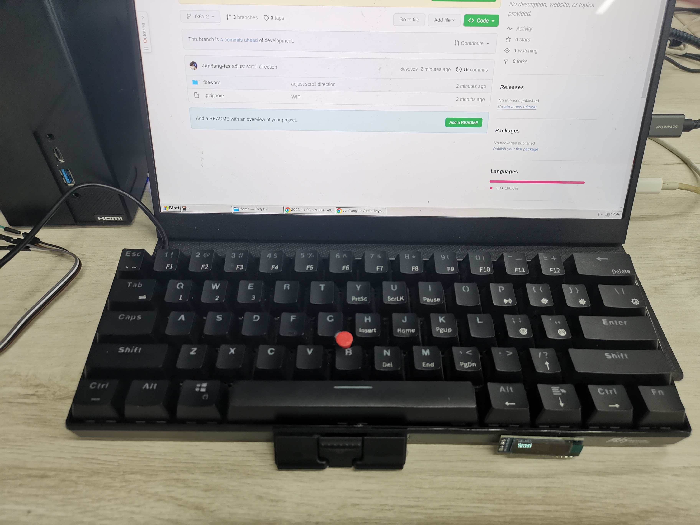
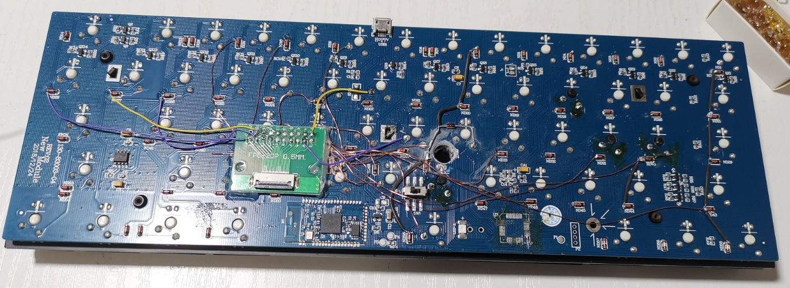
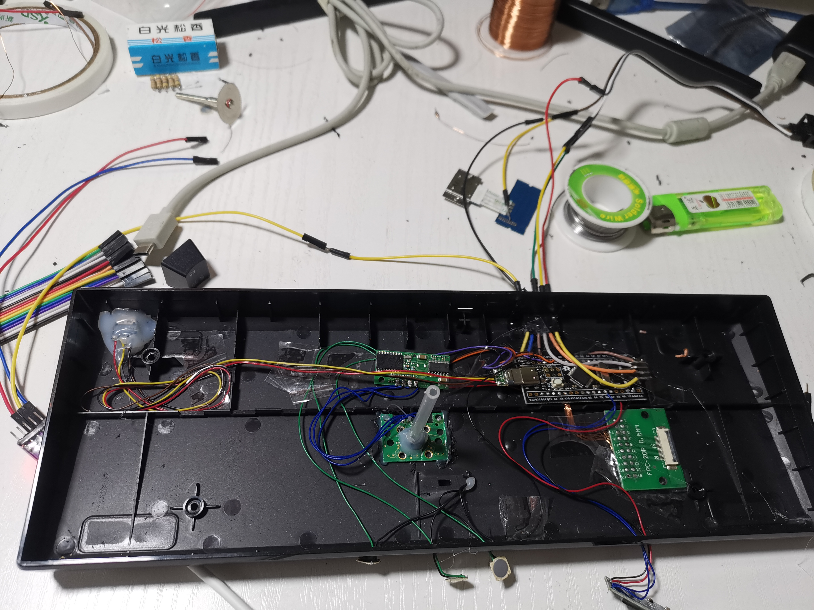

DIY 小红点键盘

## 特性
固件设计为vimer优化。
- 小红点（鼠标）
- Caps位置单独按下并释放等同与Esc，Caps 按下期间有其它键按下/释放 等同于Ctrl+那个键
- Fn + h/j/k/l 等于方向键，Fn + 数字 等于 F1 ~ F12

## 照片

部分借用了原来的PCB走线，因为打孔会断掉一些线，所以补了个二极管以及列线。

连接各名模块

## BOM

名称|数量
|--|--|
STM32f103C8T6|1
ssd1306 128x32 IIC|1
RK61 旧键盘|1
小红点模块|1
小红帽|1
开关二极管|若干
FPC 排线20pin |1
FPC 转接板20pin | 2
USB 公头 | 1
USB 母头 | 1
细导线   | 若干

